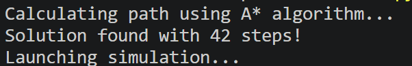
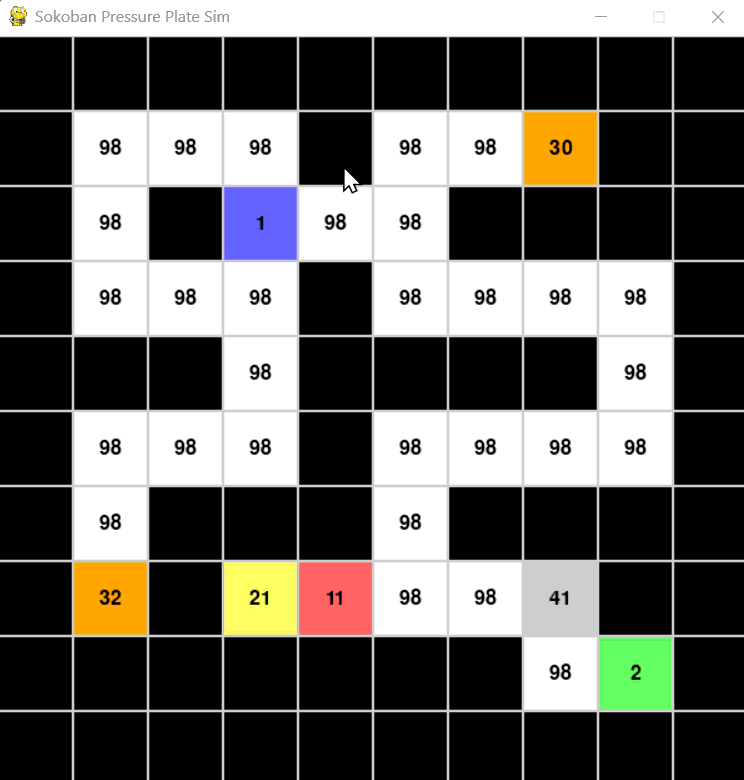
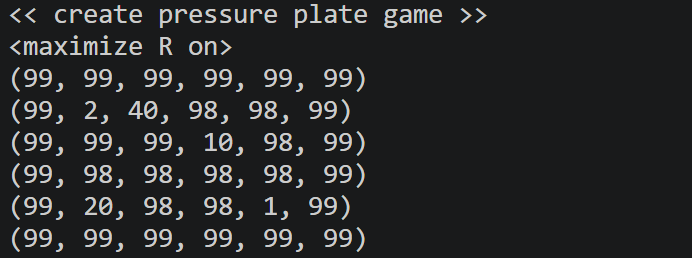
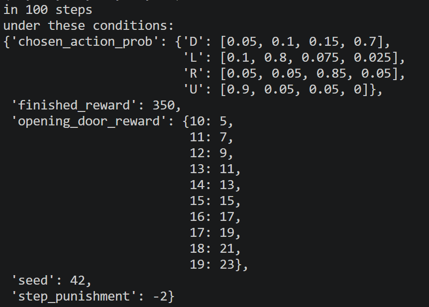
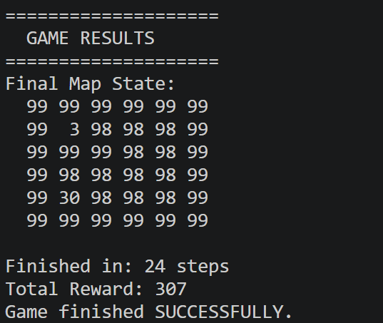
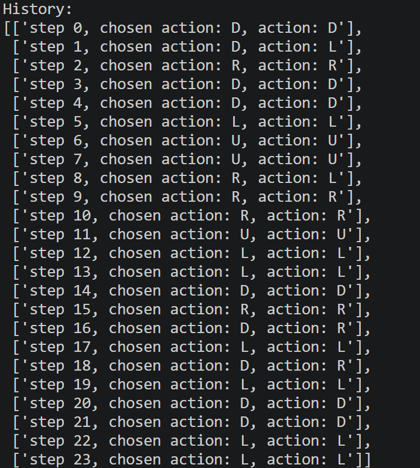

  


# Sokoban 🕹️
🤖 Sokoban solver featuring pathfinding algorithms (A, GBFS) and MDP-based decision making under uncertainty.    
Implemented in Python with custom heuristic optimization for complex puzzle configurations.

## Table of Contents

1. [About](#about)  
2. [The Environment](#the-environment)  
3. [Features](#features)  
4. [Requirements](#requirements)  
5. [Installation](#installation)  
6. [Usage](#usage)
---

## About

This project showcases the evolution of an intelligent agent solving Pressure Plate grid puzzles through two distinct AI paradigms. The challenge involves navigating a map, activating pressure plates in a specific order to unlock doors, and reaching the goal state efficiently.

The repository comprises two main approaches:

- **Deterministic Solving**: Focuses on classical state-space search using A* Search and Greedy Best-First Search (GBFS) algorithms. In this phase, the environment is predictable, and the agent's focus is on finding the most efficient sequence of actions to solve the puzzle.

- **Stochastic Solving**: Introduces environmental uncertainty where actions are probabilistic (the agent may "slip"). This phase utilizes Markov Decision Processes (MDP) and Value Iteration to create a resilient policy that can recover from unintended movements and still guarantee reaching the objective.
---

## The Environment

The agent operates within a grid-based world governed by specific tile types and interaction rules. The objective is to navigate from the starting position to the goal using the most efficient path.

### Grid Constants & Tile Types
The environment is represented by a matrix where each cell contains a value representing its state:
- **`BLANK (0)` / `FLOOR (98)`**: Walkable spaces.
- **`WALL (99)`**: Impassable obstacles.
- **`AGENT (1)` / `AGENT_ON_GOAL (3)`**: The current position of the agent.
- **`GOAL (2)`**: The target destination.
- **`KEY_BLOCKS (10-19)`**: Pushable objects used to activate plates.
- **`PRESSURE_PLATES (20-29)`**: Targets for key blocks.
- **`PRESSED_PLATES (30-39)`**: Activated plates (once a matching key block is placed).
- **`LOCKED_DOORS (40-49)`**: Obstacles that disappear only when their corresponding plates are pressed.

### Movement & Interaction
- **Orthogonal Movement**: The agent can move Up (`U`), Down (`D`), Left (`L`), or Right (`R`).
- **Pushing Mechanics**: The agent can push a single **Key Block** if the tile behind it is a floor or a plate. Once a block is placed on a **Pressure Plate**, it becomes a **Pressed Plate** and can no longer be moved.

### Stochastic Behavior (Non-Deterministic Mode)
In the stochastic version of the environment, actions are not guaranteed to succeed. The agent's movement is subject to a probability distribution (`chosen_action_prob`).

**Example Probability Mapping:**
If the agent chooses to move Up (`U`), the outcome might look like this:
- **Success (Up):** 90%
- **Slip Left:** 5%
- **Slip Right:** 5%
- **Slip Down:** 0%

### Rewards & Penalties
To optimize the agent's policy in the MDP environment, a scoring system is applied:
- **`finished_reward`**: A large bonus (e.g., `+350`) for reaching the goal.
- **`opening_door_reward`**: Incremental rewards for unlocking doors (e.g., `+5` to `+23` depending on the door type).
- **`step_punishment`**: A constant penalty for every move made (e.g., `-2`), forcing the agent to minimize total steps.

---

## Features

- **Live Visual Simulation:** A real-time graphical simulation for deterministic solving (A*), allowing you to watch the agent navigate the grid and interact with objects.
- **Dual-Search Implementation:** Support for both A* Search and Greedy Best-First Search (GBFS) to find optimal and efficient paths.
- **Stochastic Control Logging:** Detailed terminal output for the MDP environment, tracking recommended actions vs. actual outcomes to visualize environmental "slips."
- **Policy Robustness:** Advanced **Value Iteration** logic that enables the agent to recover from unintended movements and recalculate paths dynamically.
- **Grid Environment Logic:** Complete implementation of game mechanics, including pressure plates, locked doors, and multi-step objectives.
---

## Requirements

The project requires the following environment and libraries to run:

- **Python 3.13+**: The core programming language used for all logic and solvers.
- **NumPy**: Essential for matrix operations and performing Value Iteration in the MDP environment.
- **Pygame**: Used to render the live visual simulation for the deterministic pathfinding.
- **Git**: Required for cloning the repository.

---

## Installation

Follow these steps to set up the project locally:

---

### 1. Clone the repository
```bash
git clone https://github.com/Amit-Bruhim/Sokoban.git
```

### 2. Navigate into the project folder
```bash
cd Sokoban\src
```

### 3. Run the Solvers
To run the Deterministic Simulation (Visual A* Search):
```bash
py -3.13 .\run_astar.py
```
To run the Stochastic Solver (MDP / Value Iteration):
```bash
py .\run_mdp.py
```
---

## Usage

After following the installation steps, you can run the solvers. Here is what to expect from each mode:

### 1. Deterministic Solver (A*)
When running the deterministic version, the terminal will display the calculation progress, algorithm type, and the final step count found for the optimal path:  



Following the calculation, a live simulation window will appear, demonstrating the agent's real-time decisions and movement through the grid:  



---

### 2. Stochastic Solver (MDP)
When running the MDP solver, the terminal provides a detailed log of the environment's setup and the agent's performance under uncertainty. The output includes:

* **Grid Initialization:** The starting state of the game board:  
    

* **Environment Parameters:** The configured rewards, penalties, and slip probabilities:  
    

* **Final Results:** The end state of the map, total steps taken, and the accumulated reward:  
    

* **Execution History:** A step-by-step breakdown showing the "Recommended Action" (Policy) vs. the "Actual Action" performed (reflecting environmental slips):  
    